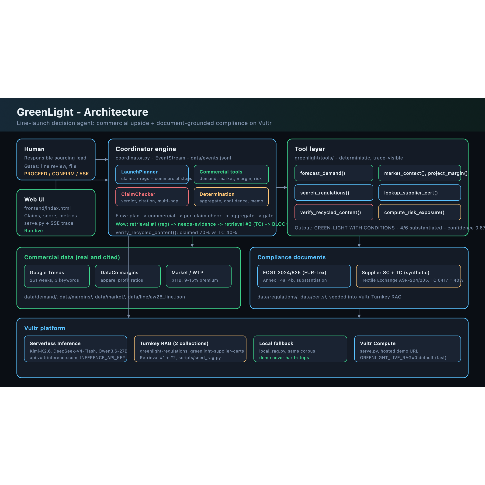

# GreenLight

**The enterprise agent that decides whether to green-light a fashion line — weighing sustainability demand upside against compliance risk, and blocking any claim the brand can't prove.**

> *Claim boldly — but only what you can prove.*

GreenLight is a **line-launch decision agent** for fashion retail. It forecasts the commercial upside of a season's sustainability positioning (demand, market size, margins), then checks every marketing claim against **real EU regulations** and **supplier evidence**. Claims that can't be substantiated are blocked with the exact regulation cited. The output is a **launch determination** a responsible-sourcing team can file: recommendation, per-claim verdicts, €-exposure avoided, and a confidence score.

It plans, calls tools across **multiple data types**, retrieves documents more than once when evidence is missing, and aggregates commercial upside vs fine exposure into one decision.

*Built solo at RAISE 2026 (team **ShipHappens**) for **Vultr Statement Two**, on Vultr Serverless Inference + Turnkey RAG, with Cursor.*

**▶ Live demo (deployed on Vultr Compute): [http://45.32.76.147/frontend/index.html](http://45.32.76.147/frontend/index.html)**

<!-- TODO: hero GIF of the compliance-catch: claim → needs-evidence → 2nd retrieval → BLOCKED + citation + score drop -->


---

## Why now — two engines

**1. Consumer pull (commercial).** Shoppers pay a premium for brands they believe are sustainable — sustainable fashion is a **~$11B market in 2026** (10.8% CAGR), and **9–15% willingness-to-pay** for verified certifications (McKinsey/BoF). That upside is why brands over-claim faster than they can prove.

**2. Regulatory crackdown (compliance).**
- **Directive (EU) 2024/825 (ECGT)** — bans generic claims ("eco-friendly", "green", "sustainable") without proof; **applies 27 Sep 2026**.
- **Penalties up to 4% of annual turnover** (Omnibus 2019/2161).
- **Shein €40M** (France DGCCRF, Jul 2025) for unsubstantiated environmental claims; H&M "Conscious" killed (NL).

GreenLight sits at the intersection: **capture the upside, drop only what you can't prove.**

<sub>Legal basis: [`docs/COMPLIANCE_BASIS.md`](docs/COMPLIANCE_BASIS.md). The *Green Claims Directive* proposal is withdrawn/in limbo — **not cited as law**.</sub>

---

## What it does (the workflow)

### Commercial layer (real data)
1. **`forecast_demand()`** — next-season demand index from **real Google Trends** (261 weeks: *sustainable fashion*, *recycled polyester*, *organic cotton*).
2. **`market_context()`** — cited market size + willingness-to-pay premium from public reports.
3. **`project_margin()`** — line contribution from per-SKU economics + **DataCo apparel margin benchmarks** (real profit ratios).
4. **`compute_risk_exposure()`** — fine exposure cap at **≤4% turnover** (€80M on a €2B brand).

### Compliance layer (document-grounded — the wow)
5. **Plans** — decomposes the AW26 line into commercial steps + *claims × regulations*.
6. **Retrieves (#1)** — regulation clause for each claim (Vultr Turnkey RAG + local fallback).
7. **Decides + finds a gap** — `"70% recycled polyester"` → `needs-evidence`.
8. **Retrieves (#2)** — pulls the **supplier Transaction Certificate** (Scope Cert valid, TC covers only **40%**).
9. **`verify_recycled_content()`** — recalculates claimed % vs TC coverage → **BLOCKED** + ECGT citation + remediation.
10. **Aggregates** → **GREEN-LIGHT WITH CONDITIONS**: net upside vs €-exposure avoided, confidence score.

---

## The agent (this is a real tool-calling agent, not a script)

GreenLight's decisions are driven by **`moonshotai/Kimi-K2.6`** running a **native tool-calling loop** on Vultr Serverless Inference — the model decides *which* tool to call and *when*, then reasons over the results. It is not a hardcoded pipeline.

The loop (`greenlight/agents/agent.py`):

1. Kimi receives the line brief + all 6 marketing claims and states its plan.
2. It calls the **commercial tools** — `forecast_demand`, `market_context`, `project_line_margin`.
3. For **each claim** it calls `search_regulations` (**retrieval #1**, Turnkey RAG). If a recycled-content claim isn't yet substantiated, it goes back for `lookup_supplier_cert` (**retrieval #2**) and runs `verify_recycled_content`.
4. It submits a verdict per claim via `submit_claim_verdict` — a **grounding guard** rejects any `substantiated` verdict that lacks a document citation (this is what makes "0 hallucinated compliance" true, not aspirational).
5. It calls **`discover_claim_opportunities`** — scans **real Google Trends** ethical keywords (`cruelty free fashion`, `vegan fashion`) against line materials the brand is *not yet claiming*. For each rising opportunity (e.g. RDS down on the puffer, RWS wool on the sweater), Kimi runs the same regulation + supplier-cert checks and submits `submit_opportunity_verdict` — recommending **ADD TO LAUNCH** only when substantiated.
6. It calls `compute_risk_exposure`, then `finalize_determination` (including recommended claim additions and projected uplift).

A **human gate** then pauses the agent — the launch owner clicks **Approve & file** (or **Hold**) before the determination becomes a record. Every tool call, retrieval hop, and verdict streams live to the UI over SSE.

> A deterministic fallback runs the *same* tools without the LLM (`GREENLIGHT_LIVE_LLM=0`) so the repo clones-and-runs with no keys and the demo never hard-stops.

### Models — right model per job (Vultr Serverless Inference)

| Job | Model | Status |
|---|---|---|
| **Agent brain** — plans, calls tools, decides | **`moonshotai/Kimi-K2.6`** | **Live** — drives the loop (`greenlight/agents/agent.py`) |
| **Document-grounded retrieval reasoning** — "does this clause / cert substantiate the claim?" | **`deepseek-ai/DeepSeek-V4-Flash`** | **Live** — Turnkey RAG endpoint (`greenlight/sources/vultr_rag.py`) |
| **Structured determination copy** | **`Qwen/Qwen3.6-27B`** | Verified on Vultr; determination currently assembled deterministically from tool outputs |

Model IDs verified via `GET /v1/models` on 2026-07-04 (`scripts/smoke_vultr.py`, 16/16 green).

---

## How it maps to Vultr Statement Two (the rubric)

| Vultr asks for | GreenLight | Code |
|---|---|---|
| **Agent** (not retrieve-then-answer) | **Kimi-K2.6 native tool-calling loop** + human gate + live trace | `greenlight/agents/agent.py` |
| **Plans** | Kimi states its plan; commercial assessment + claims × regs | `greenlight/agents/agent.py`, `planner.py` |
| **Aggregates across data types** | Regulations + certs + Trends + margins + market constants | `greenlight/agents/tooling.py` + `data/` |
| **Predicts / discovers upside** | `forecast_demand()` + **`discover_claim_opportunities()`** → rising ethical demand matched to substantiatable line materials | `greenlight/tools/__init__.py` |
| **Retrieves more than once** | Reg lookup (#1), then **supplier cert** (#2) on gap | `greenlight/sources/vultr_rag.py` |
| **Calls tools** | Agent chooses: commercial tools, claim checks, **`discover_claim_opportunities`**, **`submit_opportunity_verdict`**, risk + finalize | `greenlight/agents/tooling.py` |
| **Makes decisions** | Per-claim verdict (grounding-guarded) + **launch recommendation** | `greenlight/agents/agent.py`, `claim_checker.py` |
| **Human-in-the-loop** | Agent pauses for launch-owner sign-off before filing | `serve.py` (`WebHuman` + `/api/approve`) |
| **Usable enterprise outcome** | Cited line-launch determination | `greenlight/agents/determination.py` |
| **Grounds in documents** | Every blocked claim cites ECGT + supplier doc | `data/regulations/`, `data/certs/` |

**Objective results (demo run on Élan Studio AW26):**
- Claims: **4 substantiated / 2 blocked** (C1 recycled gap, C2 generic "eco-friendly")
- **100%** of decisions carry a document citation · **0** hallucinated compliance
- Demand index from real Google Trends · line contribution **€5.1M** · up to **€80M** exposure avoided
- **Confidence 0.67** · recommendation: **GREEN-LIGHT WITH CONDITIONS**

---

## Architecture



<sub>Vector source: [`frontend/architecture.svg`](frontend/architecture.svg)</sub>

**Kimi-K2.6 agent** (plans → commercial tools → multi-hop retrieval → per-claim verdicts → aggregation) with a **human gate** and **SSE event trace** to the UI. **Document layer:** two Vultr Turnkey RAG collections (`greenlight-regulations`, `greenlight-supplier-certs`) seeded from `data/`, with deterministic local keyword fallback so the demo never hard-stops. Model roles: see [Models](#models--right-model-per-job-vultr-serverless-inference) above and [`docs/VULTR.md`](docs/VULTR.md).

---

## Quick start

```bash
python3 serve.py                    # http://localhost:8000/frontend/index.html → ▶ Run compliance review
python3 scripts/demo_test.py        # assertions: 4/6 cleared, 2 blocked
python3 greenlight/run.py           # CLI trace (~instant)
python3 scripts/smoke_data.py       # data + retrieval integrity (17 checks)
python3 scripts/seed_rag.py         # (once) seed Vultr Turnkey RAG collections
```

Runs **fully offline** with local retrieval over the same corpus (no keys needed). With `INFERENCE_API_KEY` in `.env`, live Vultr inference + RAG are available:

```bash
GREENLIGHT_LIVE_RAG=1 python3 scripts/live_run.py   # ~60–90s, live Turnkey RAG
GREENLIGHT_LIVE_RAG=1 GREENLIGHT_LIVE_LLM=1 python3 serve.py
```

**Deployed on Vultr Compute** (Ubuntu 22.04, Los Angeles): **[http://45.32.76.147/frontend/index.html](http://45.32.76.147/frontend/index.html)** — one-command deploy via `python3 scripts/deploy_vultr.py` (systemd service, live RAG + inference on). Full guide: [`docs/DEPLOY.md`](docs/DEPLOY.md).

---

## Data — real, cited, reproducible

GreenLight runs on **real public data wherever the decision depends on facts.** Only the fictional brand's *marketing claims* and its suppliers' *certificates* are synthetic — and both are labelled as such on screen. Every real series is either committed or re-fetchable via `python3 scripts/fetch_data.py`, and data integrity is checked by `scripts/smoke_data.py` (17/17 green).

**Regulation corpus — EU Directive 2024/825 (ECGT).** Verbatim excerpts from [EUR-Lex](https://eur-lex.europa.eu/legal-content/EN/TXT/?uri=CELEX:32024L0825) — the Annex I ban on generic environmental claims and the substantiation duty. Seeded into the `greenlight-regulations` Vultr Turnkey RAG collection; this is **retrieval #1** and the source of every on-screen citation. (`data/regulations/ecgt_2024_825.md`)

**Demand signal — Google Trends.** 261 weekly observations (2021–2026) for sustainability queries (*sustainable fashion*, *recycled polyester*, *organic cotton*) plus ethical queries (*cruelty free fashion*, *vegan fashion*, *responsible wool*). `forecast_demand()` and `discover_claim_opportunities()` derive demand indices from recent-vs-prior 12-week averages. Re-fetch: `python3 scripts/fetch_data.py`. (`data/demand/trends_sustainability.csv`, `data/demand/trends_ethical.csv`)

**Margins — DataCo Smart Supply Chain.** Real apparel profit ratios distilled from the DataCo Supply Chain dataset into per-category benchmarks used by `project_margin()` for line-contribution economics. The raw multi-hundred-MB source is gitignored; the derived benchmark CSV is committed. (`data/margins/datac_apparel_benchmarks.csv`)

**Market & willingness-to-pay — cited constants.** Sustainable fashion market **~$11B (2026), 10.8% CAGR** (Roots Analysis); **9–15% WTP** premium for verified certifications (McKinsey/Business of Fashion); recycled-polyester baseline (Textile Exchange Materials Market Report 2025). Each value carries its `source` field. (`data/market/market_context.json`)

**Enforcement context.** Shein **€40M** (France DGCCRF, Jul 2025) for unsubstantiated environmental claims; the **≤4% of annual turnover** penalty basis (Omnibus 2019/2161). Real and cited. (`docs/COMPLIANCE_BASIS.md`)

**Product line — synthetic scenario.** A 6-SKU AW26 line whose *attributes* (categories, fibre compositions, price bands) are modeled on the open Livostyle catalog; the *brand* and its *marketing claims* are authored for the scenario. GL-01 includes RDS-certified down fill and GL-02 includes RWS merino wool — materials the agent can discover as **new substantiatable claims** when ethical demand is rising. (`data/line/aw26_line.json`)

**Supplier certificates — synthetic, structurally authentic.** GRS/RCS **Scope** + **Transaction** Certificates following the Textile Exchange ASR-204/205 structure. The demo's key realism: the Scope Certificate is valid, but the Transaction Certificate for the shipment covers only **40%** vs the claimed **70%** — which is exactly how real recycled-content claims fail. Seeded into the `greenlight-supplier-certs` collection; this is **retrieval #2**. (`data/certs/`)

| Dataset | Source | Real / synthetic |
|---|---|---|
| Regulations | ECGT (EU) 2024/825 excerpts (EUR-Lex) | **Real** |
| Enforcement context | Shein €40M, 4% penalty basis | **Real, cited** |
| Demand signal | Google Trends (261 weeks, 3 keywords) | **Real** |
| Margins | DataCo Smart Supply Chain → apparel benchmarks | **Real** |
| Market / WTP | Roots Analysis, McKinsey/BoF, Textile Exchange | **Real, cited** |
| Product line | 6-SKU AW26 line (Livostyle-derived attributes) | Attributes **real**; claims **synthetic (scenario)** |
| Supplier certs | GRS/RCS Scope + Transaction Certificates | **Synthetic**, structurally authentic |

Full provenance table: [`data/README.md`](data/README.md).

---

## Author

Architected and built **solo** at RAISE 2026 by **[NAME]** (team ShipHappens). Coordination engine written fresh during the event; document-grounding via Vultr Turnkey RAG; commercial layer on real cited public data.

---

## Status

**Deployed & live on Vultr:** Kimi-K2.6 agent loop + Turnkey RAG verified end-to-end (`scripts/live_run.py`, `scripts/smoke_vultr.py` 16/16). Running at [http://45.32.76.147/frontend/index.html](http://45.32.76.147/frontend/index.html). Enterprise demo UI with live human-in-the-loop gate. Backup video pending.
